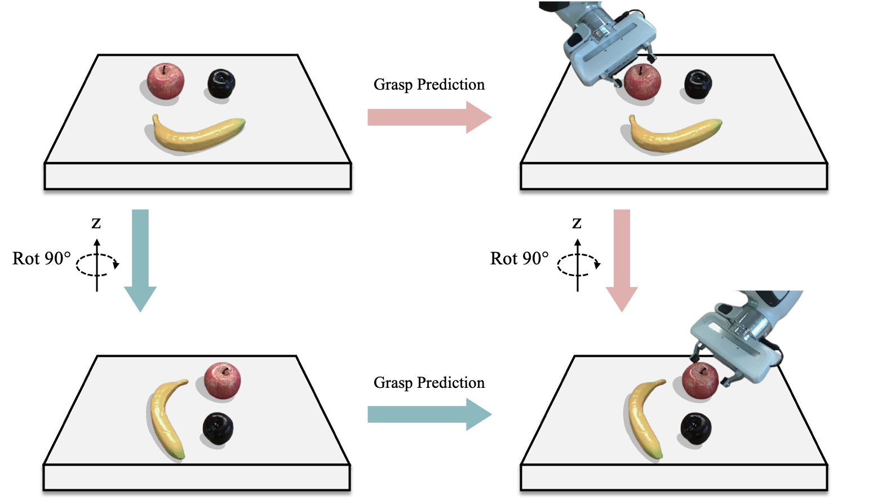
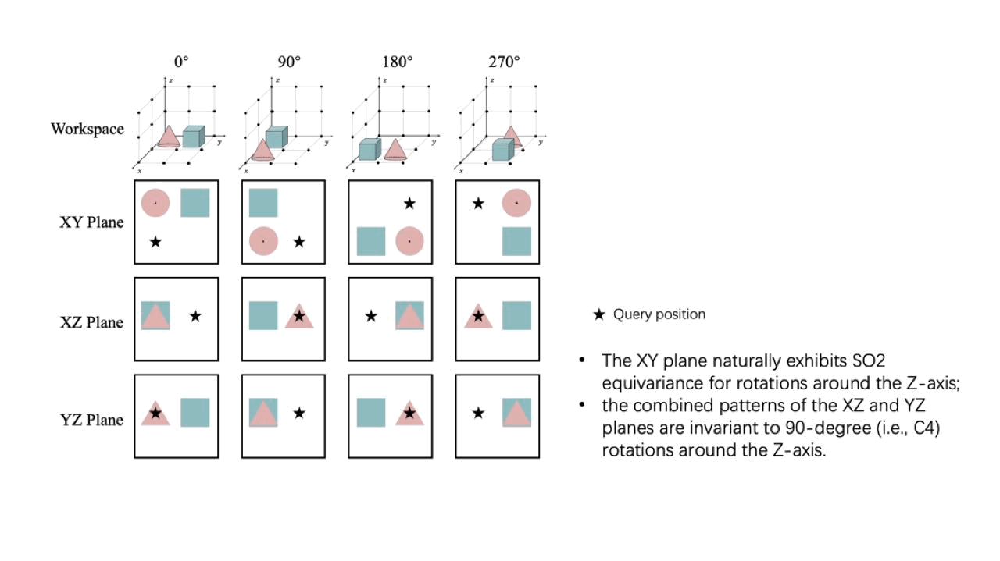

# Equivariant Volumetric Grasping

This repo is the official implementation of the paper: Equivariant Volumetric Grasping.

[[Project](https://mousecpn.github.io/evg-page/)] [[Arxiv](https://arxiv.org/abs/2507.18847)] [[Realworld](https://github.com/mousecpn/fr3_grasp_ws)]

<p align="center">
    
</p>

## :star2: Highlights

- An [Equivariant Triplane UNet](model/triunet.py) for volumetric grasping

- [Deformable Steerable Convolution](model/equi_deform_conv.py)

- This repo also contains **a clean and simple implementation** for [GIGA](https://github.com/UT-Austin-RPL/GIGA) and [IGD](https://github.com/mousecpn/Implicit-Grasp-Diffusion), which is compatible with their pretrained checkpoint.

- The equivariant version of GIGA ([EquiGIGA](model/equi_giga.py)) and IGD ([EquiIGD](model/equi_igd.py))

## :bulb: Key insight

<p align="center">
    
</p>


## 🔧 Installation

1. Create a conda environment.

2. Install packages list in [requirements.txt](requirements.txt). Then install `torch-scatter` following [here](https://github.com/rusty1s/pytorch_scatter) (only for GIGA and IGD), based on `pytorch` version and `cuda` version.

3. Go to the root directory and install the project locally using `pip`

```
pip install -e .
```

4. Data collection can be referred to this [repo](https://github.com/mousecpn/grasp-data-collection).

## Training

```bash
./train.sh (giga | igd | equi_giga | equi_igd) --dataset /path/to/new/data --dataset_raw /path/to/raw/data --num_workers 12 --epochs 12 --batch_size 128
```

<!-- ### Train EquiIGD

Run:

```bash
python train_equiigd.py --dataset /path/to/new/data --dataset_raw /path/to/raw/data
```

### Train GIGA

Run:

```bash
python train_giga.py --dataset /path/to/new/data --dataset_raw /path/to/raw/data
```

### Train IGD

Run:

```bash
python train_igd.py --dataset /path/to/new/data --dataset_raw /path/to/raw/data
``` -->

## Validation

```bash
python scripts/sim_grasp_multiple.py --num-view 1 --object-set (packed/test | pile/test) --scene (packed | pile) --num-rounds 100 --sideview --add-noise dex --force --best --model /path/to/model --type (giga | igd | equi_giga | equi_igd) --result-path /path/to/result
```

This commands will run experiment with each seed specified in the arguments.

Run `python scripts/sim_grasp_multiple.py -h` to print a complete list of optional arguments.

## 🙏 Acknowledgement
- Data collection code from [GIGA](https://github.com/UT-Austin-RPL/GIGA) and [OrbitGrasp](https://github.com/BoceHu/orbitgrasp).
- Triplane UNet and Decoder are largely based on [GIGA](https://github.com/UT-Austin-RPL/GIGA).
- Diffusion rotation decoders are from [IGD](https://github.com/mousecpn/Implicit-Grasp-Diffusion).
- Thanks to [ESCNN](https://github.com/QUVA-Lab/escnn) for their easy-to-use steerable convolution coding tutorials and tools.


## Citing
```
@article{song2025equivariant,
  title={Equivariant Volumetric Grasping},
  author={Song, Pinhao and Hu, Yutong and Li, Pengteng and Detry, Renaud},
  journal={arXiv preprint arXiv:2507.18847},
  year={2025}
}
```

